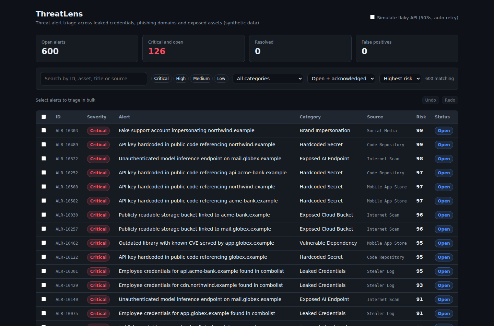
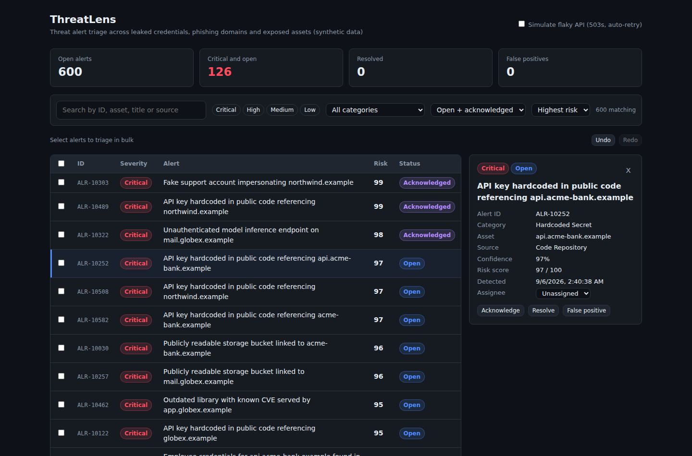

# ThreatLens

A React dashboard for triaging threat alerts (leaked credentials, phishing domains, exposed cloud buckets, exposed AI endpoints, hardcoded secrets and more). Built with a **hand-written Webpack 5 + Babel + Sass toolchain** (no Create React App, no Vite) so every build step is explicit.

All data is synthetic: 600 alerts generated by a seeded script against made-up `.example` domains.



## Features

- **Triage workflow:** acknowledge, resolve, mark false positive, reopen and assign, on one alert or in bulk.
- **Undo / redo** for every triage action (buttons, `Ctrl+Z`, `Ctrl+Shift+Z` / `Ctrl+Y`), built on the command pattern.
- **Debounced search** (250 ms) across ID, title, asset and source, plus severity chips, category, status and sort filters.
- **Resilient data loading:** the feed is fetched through `fetchWithRetry` with exponential backoff and jitter. Only 5xx/429 and network errors are retried; 4xx fail fast; requests are abortable. Tick "Simulate flaky API" to watch it recover from two 503s.
- **Code splitting:** the alert detail panel (`React.lazy`) and the alert feed JSON load as separate chunks; React lives in a long-cached vendor chunk.
- **Responsive:** throttled resize listener hides secondary columns on narrow screens.



## How it is structured

```
src/
  core/           Plain JavaScript, no React
    EventEmitter.js     constructor function + prototype methods (classic OOJS)
    Alert.js            immutable model class with derived getters (riskScore, isOpen)
    CommandHistory.js   undo/redo stacks (class extends the prototype-based emitter)
    AlertStore.js       central store; TriageCommand base class + StatusCommand / AssignCommand subclasses
    query.js            pure filter / sort / paginate / stats functions
  api/
    withRetry.js        withRetry(), fetchWithRetry(), HttpError
    alertsApi.js        mock fetch transport with latency and injectable 503s
  utils/                debounce (cancel/flush) and throttle (trailing call), written from scratch
  hooks/                useAlertStore (useSyncExternalStore), useDebouncedValue, useWindowWidth, useUndoRedoShortcuts
  containers/           STATEFUL: data loading, filters, selection, pagination, store commands
  components/           STATELESS / presentational: render from props only
  styles/               Sass: abstracts (tokens, mixins, @use/@forward), base, BEM layout
```

**Container vs presentational components.** `DashboardContainer` and `AlertDetailContainer` own state and talk to the store. Everything in `components/` (`AlertTable`, `FilterBar`, `StatsBar`, `SeverityBadge`, `Toolbar`, `AlertDetail`) receives props and callbacks and has no data access, which is why they can be tested in isolation.

**CSS architecture.** Two approaches side by side, by design:
- **Global BEM** (`.app`, `.app__header`, `.app__body--single`, `.button--primary`) for page layout and shared primitives, in `styles/layout/_app.scss`.
- **CSS Modules** (`*.module.scss`) for component styles, scoped automatically by css-loader. Severity and status colours are generated with Sass `@each` loops over token maps, so adding a severity is a one-line change.

**Webpack config highlights** (`webpack.config.js`): babel-loader for JSX/ES2020+, separate loader chains for CSS Modules vs global Sass, `MiniCssExtractPlugin` + content-hashed filenames in production, `splitChunks` vendor chunk, `runtimeChunk: "single"`, and `publicPath: "auto"` so the same build works at a domain root or under `github.io/threatlens/`.

## Numbers

| | |
|---|---|
| Tests | 29 passing (Jest + React Testing Library), 4 suites |
| Coverage | 88.5% statements |
| Initial JS + CSS | ~53 KiB gzipped (vendor 43.9, main 5.8, runtime 2.1, CSS 1.4) |
| Lazy chunks | detail panel 0.8 KiB, alert feed 13.8 KiB (gzipped) |

## Run it

```bash
npm install
npm start          # dev server on http://localhost:3000
npm test           # Jest
npm run build      # production build into dist/
npm run gen:data   # regenerate the synthetic feed (same seed = same data)
```

## Deploy

Pushing to `main` runs `.github/workflows/ci.yml`: install, test, build, then publish `dist/` to GitHub Pages. One-time setup: repo **Settings > Pages > Source: GitHub Actions**.

## Limitations (honest list)

- Data is synthetic and the API is an in-browser mock; there is no real backend.
- Triage changes live in memory and reset on reload.
- Pagination is client-side; a real feed would paginate on the server.
